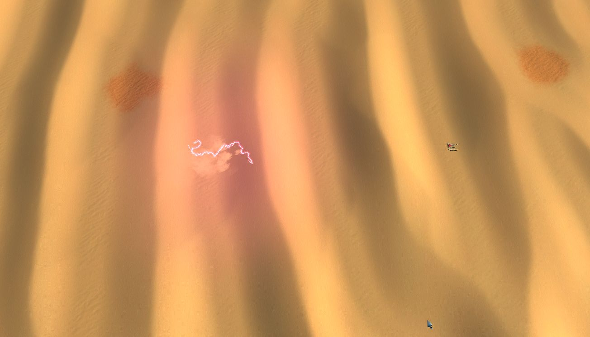

# Cattle and Loveplay

Map for Spring RTS with sand worms.

## Installation

- Get it on springfiles and put it in the same place. http://springfiles.com/spring/spring-maps/cattle-and-loveplay-0

- Clone the repository into ~/.spring/cattle-and-loveplay.sdd/ or Documents/My Games/Spring/maps/cattle-and-loveplay.sdd/

## Giving Another Map Worms

- Copy the following directories from this repository into the map:
    - a-star-lua/
    - bitmaps/
    - gamedata/
    - icons/
    - LuaGaia/
    - LuaUI/
    - objects3d/
    - scripts/
    - sounds/
    - unitpics/
    - units/
    - unittextures/
    - wormconfig/

- Edit wormconfig/wormconfig.lua so that every terrain type that the worm moves is a key of the table sandType with a value of true.

- *Optional, but you're stuck with the defaults* Copy the and paste following keys from MapOptions.lua:
    - 1_terrain_sect
    - restrict_sand_building
    - sink_wrecks
    - 2_sworm_sect
    - sand_worms
    - sworm_aggression
    - sworm_worm_speed
    - sworm_eat_mex
    - sworm_eat_commander

- *Optional, but dust from the worm's movement will look funny* Edit the colormaps in gamedata/explosions/swormfx.lua so that all instances of 0.9 0.72 0.44 are changed to a color that blends with the terrain of your map.

